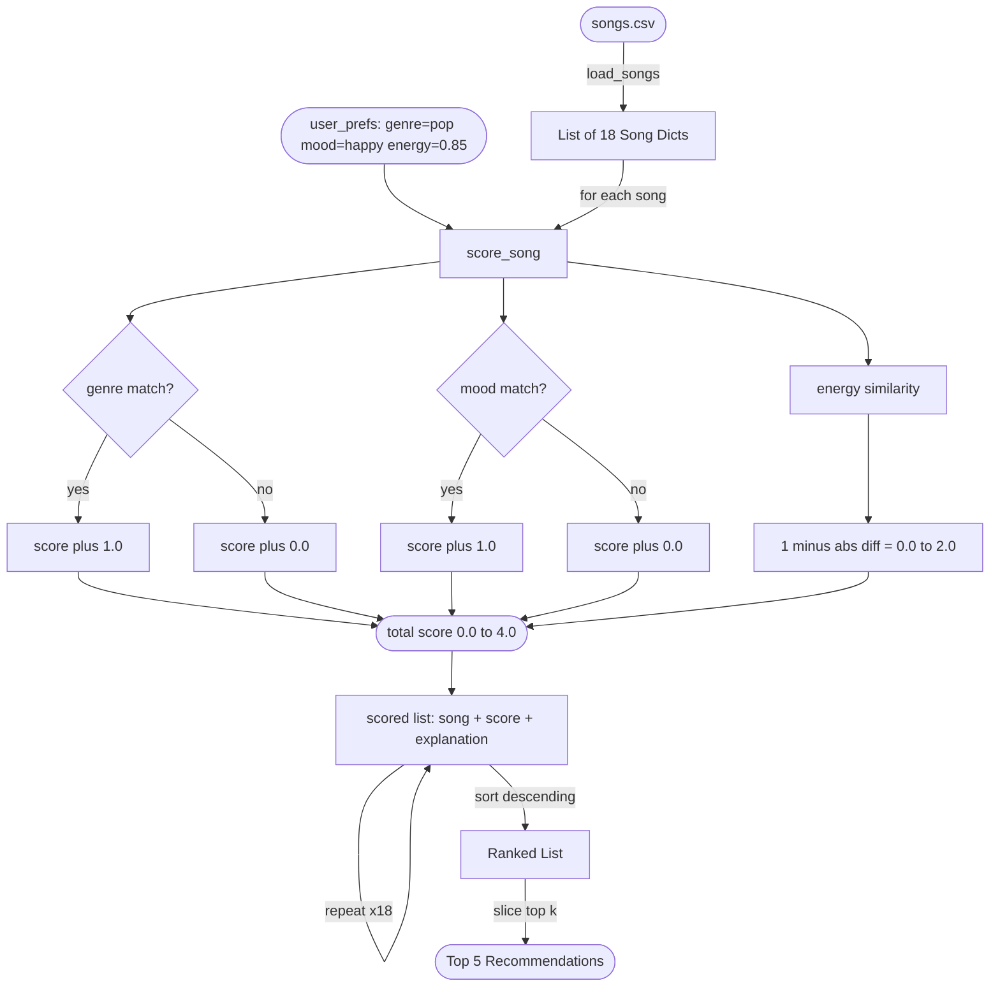

# Data Flow Diagram — Music Recommender Simulation

Visualizes how a single song moves from the CSV file to the final ranked list.



## Step-by-Step Breakdown

| Step | What Happens | Code Location |
|---|---|---|
| 1 | `load_songs()` reads all 18 rows from `songs.csv`, casts types | `recommender.py:106` |
| 2 | `recommend_songs()` loops over every song | `recommender.py:137` |
| 3 | `score_song()` checks genre match → +2.0 or +0.0 | `recommender.py:91` |
| 4 | `score_song()` checks mood match → +1.0 or +0.0 | `recommender.py:95` |
| 5 | `score_song()` computes energy similarity → +0.0 to +1.0 | `recommender.py:99` |
| 6 | Score + explanation appended to `scored` list | `recommender.py:138` |
| 7 | `scored.sort()` ranks all songs highest to lowest | `recommender.py:141` |
| 8 | Top `k` sliced and returned | `recommender.py:142` |
| 9 | Title, score, and explanation printed | `main.py:35` |

## Max Possible Score: 4.0

```
genre match   +2.0
mood match    +1.0
energy sim    +1.0  (when song.energy == user target exactly)
              ────
total          4.0
```
